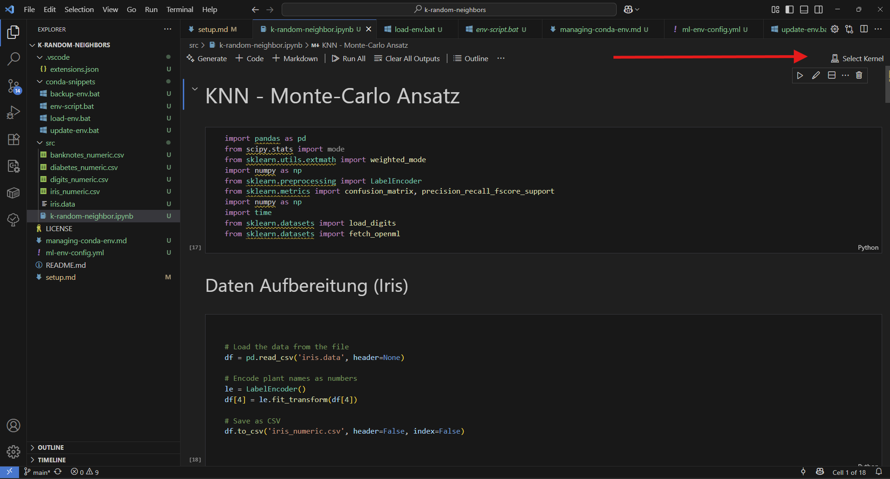
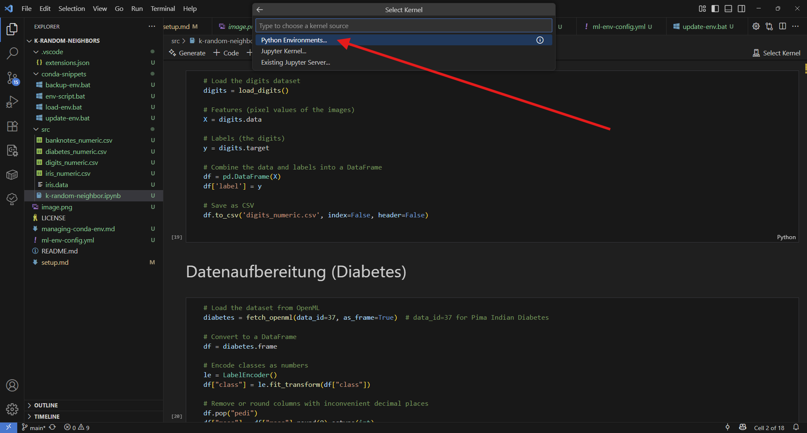
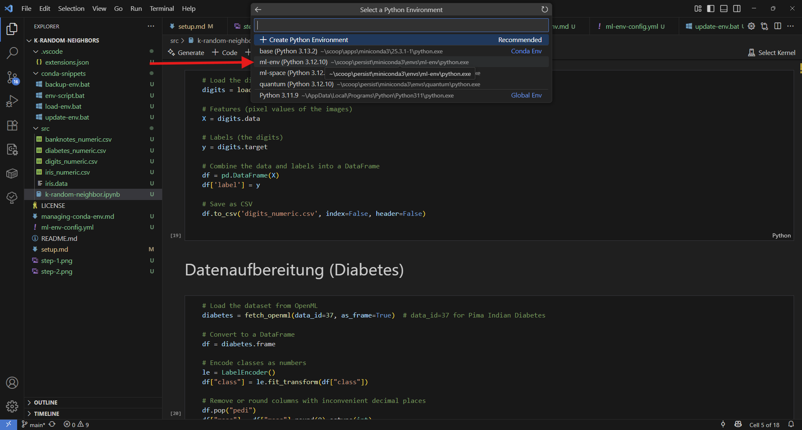

# 🚀 Project Setup Instructions

To run the project on Windows 10/11, the following software is recommended:

1. Conda
2. VS Code

## Install Conda (via Scoop)

Conda is a virtual environment manager for Python. It comes in two flavors: Anaconda and Miniconda3. I strongly recommend Miniconda3 because it is quick to install, easy to use via the command line, and not bloated like Anaconda.

To install Miniconda on Windows, I recommend Scoop—a command-line installer for Windows, similar to `apt` on Debian systems.

1. Install Scoop by following the instructions at [https://scoop.sh/](https://scoop.sh/)
2. Install Miniconda3 by entering `scoop bucket add extras` into the command line, followed by `scoop install extras/miniconda3`

## Set Up VS Code

1. If not already installed, you can install VS Code from the web, Microsoft Store, or via Scoop by entering `scoop bucket add extras` followed by `scoop install extras/vscode`. (Note: If you added the *extras* bucket in the previous step, you don’t need to repeat it here.)
2. When opening this project in VS Code, a pop-up should appear asking if you want to install the recommended extensions for this project. Click "Yes."

## Set Up Virtual Environment via Conda

1. Open the terminal in the root of this project and use the command `conda env create --file ml-env-config.yml` to create a Conda environment named `ml-env` and automatically install all required packages.
2. Open `src\k-random-neighbor.ipynb`
3. To execute the code in this file, you must select the Conda environment `ml-env` as the kernel for the Jupyter notebook.
   
   
   